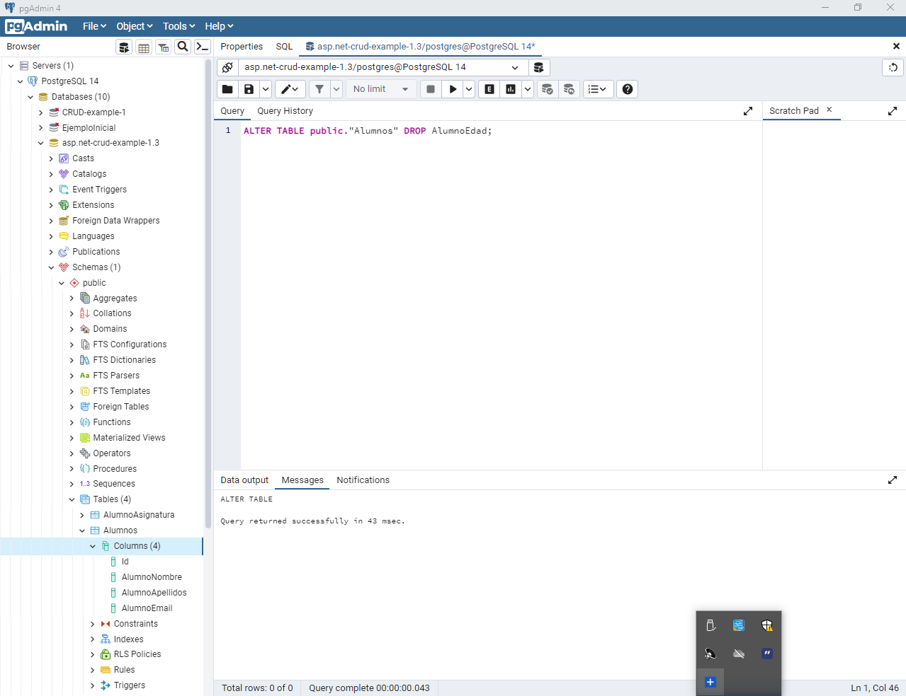

# EntityFramework-MVC-CRUD-example-1.4
## Database First

En esta ocasión, partimos de la base del proyecto de ejemplo v1.3, pero con la parte del DAL vacía (tan sólo con un par de carpetas, con la carpeta *Models* y la carpeta *DataContexts*), y con que en *pgAdmin* ya tenemos la BBDD con las tres tablas que se crearon con la migración (Code First) de la v1.3 (por tanto, en esta nueva versión del ejemplo, utilizaremos también la misma BBDD que en la v1.3).


**Nota**: si hemos copiado y pegado el proyecto v1.3, a priori nos salen muchísimos errores por el tema de las referencias en *using* y *namespace*... en mi caso, he ido cambiando manualmente en todos los archivos, la terminación de v1.3 por la v1.4, pero esto lo hice así porque en este momento no teníamos internet en la clase y no podía crear un proyecto nuevo y hacerlo desde cero... en tu caso, es más recomendable crearlo de nuevo desde cero.

En mi caso, al hacer copia/pega del proyecto anterior (v1.3), he tenido que quitar todos los trozos de código (o hasta clases enteras) donde se referenciaban los modelos o el context que había en el DAL... los cuales ahora mismo no existen! 
En tu caso, si has creado el proyecto de nuevo desde cero, céntrate en lo que viene ahora del DB Firt y deja las cosas del proyecto principal para después...

**Recuerda**: para que el comando de Scaffold funcione correctamente, no podemos tener ni el más mínimo error de compilación en nuestro código!

# 1. Database First

En esta ocasión, partimos de la base de que en la capa DAL no tenemos ni las clases modelos de Alumnos-Asignaturas-RelAlumAsig, ni contamos con el *PostgreSqlContext*.
Para crear todos estos archivos automáticamente a través de una BBDD ya existente, necesitamos ejecutar un comando de Scaffold en la consola administradora de NuGets desde el punto de vusta de la capa DAL.

`Scaffold-DbContext "Host=localhost;Port=5432;Pooling=true;Database=asp.net-crud-example-1.3;UserId=postgres;Password=12345;" Npgsql.EntityFrameworkCore.PostgreSQL -OutputDir Models`

Cuando ejecutemos este comando (sin previamente tener errores de compilación en nuestro código), veremos que automáticamente se nos crea el *DbContext* necesario y las clases de modelos *Asignatura* y *Alumno*

**Nota**: como en el proyecto de ejemplo v1.3, al hacer la migración (Code First) teníamos definida la relación entre Alumnos y Asignaturas como una relación simple de one-to-many, Scaffold no nos ha creado el modelo de relación de *RelAlumAsig* (aunque si estuviese en la BBDD)

**Nota**: el DbContext nos lo generará al lado (mismo nivel) que los modelos, pero yo lo he movido manualmente (arrastrando con el ratón) hacia la carpeta *DataContexts* y las referencias se actualizan solas automáticamente)

## *Alumno.cs*

```csharp
using System;
using System.Collections.Generic;

namespace ASP.NET_CRUD_example_1._4_DAL.Models
{
    public partial class Alumno
    {
        public Alumno()
        {
            ListaAsignaturas = new HashSet<Asignatura>();
        }

        public int Id { get; set; }
        public string AlumnoNombre { get; set; } = null!;
        public string AlumnoApellidos { get; set; } = null!;
        public string AlumnoEmail { get; set; } = null!;

        public virtual ICollection<Asignatura> ListaAsignaturas { get; set; }
    }
}
```

## *Asignatura.cs*

```csharp
using System;
using System.Collections.Generic;

namespace ASP.NET_CRUD_example_1._4_DAL.Models
{
    public partial class Asignatura
    {
        public Asignatura()
        {
            ListaAlumnos = new HashSet<Alumno>();
        }

        public int Id { get; set; }
        public string AsignaturaNombre { get; set; } = null!;

        public virtual ICollection<Alumno> ListaAlumnos { get; set; }
    }
}
```

## *aspnetcrudexample13Context.cs*

```csharp
using System;
using System.Collections.Generic;
using ASP.NET_CRUD_example_1._4_DAL.Models;
using Microsoft.EntityFrameworkCore;
using Microsoft.EntityFrameworkCore.Metadata;

namespace ASP.NET_CRUD_example_1._4_DAL.DataContexts
{
    public partial class aspnetcrudexample13Context : DbContext
    {
        public aspnetcrudexample13Context()
        {
        }

        public aspnetcrudexample13Context(DbContextOptions<aspnetcrudexample13Context> options)
            : base(options)
        {
        }

        public virtual DbSet<Alumno> Alumnos { get; set; } = null!;
        public virtual DbSet<Asignatura> Asignaturas { get; set; } = null!;

        protected override void OnConfiguring(DbContextOptionsBuilder optionsBuilder)
        {
            if (!optionsBuilder.IsConfigured)
            {
#warning To protect potentially sensitive information in your connection string, you should move it out of source code. You can avoid scaffolding the connection string by using the Name= syntax to read it from configuration - see https://go.microsoft.com/fwlink/?linkid=2131148. For more guidance on storing connection strings, see http://go.microsoft.com/fwlink/?LinkId=723263.
                optionsBuilder.UseNpgsql("Host=localhost;Port=5432;Pooling=true;Database=asp.net-crud-example-1.3;UserId=postgres;Password=12345;");
            }
        }

        protected override void OnModelCreating(ModelBuilder modelBuilder)
        {
            modelBuilder.Entity<Alumno>(entity =>
            {
                entity.HasMany(d => d.ListaAsignaturas)
                    .WithMany(p => p.ListaAlumnos)
                    .UsingEntity<Dictionary<string, object>>(
                        "AlumnoAsignatura",
                        l => l.HasOne<Asignatura>().WithMany().HasForeignKey("ListaAsignaturasId"),
                        r => r.HasOne<Alumno>().WithMany().HasForeignKey("ListaAlumnosId"),
                        j =>
                        {
                            j.HasKey("ListaAlumnosId", "ListaAsignaturasId");

                            j.ToTable("AlumnoAsignatura");

                            j.HasIndex(new[] { "ListaAsignaturasId" }, "IX_AlumnoAsignatura_ListaAsignaturasId");
                        });
            });

            OnModelCreatingPartial(modelBuilder);
        }

        partial void OnModelCreatingPartial(ModelBuilder modelBuilder);
    }
}
```

# 2. Volvemos a crear las clases que había en el proyecto principal de la v1.3

- DataSeeders --> DataSeeder.cs
- Models --> AsignaturaViewModel.cs
- En el Program.cs definimos el servicio de conexión a nuestra BBDD con el nuevo DbContext autogenerado por Scaffold, y volvemos a llamar al método Seed()
- El controlador que hicimos en la v1.3 ahora lo llamaremos *RelAlumAsigController.cs*, al igual que su carpeta de la vista, que también la vamos a renombrar de esta manera (no olvides también actualizarlo/ponerlo bien en el navbar del *_Layout.cshtml*)

Y si ahora ejecutamos el proyecto... vemos que sigue funcionando perfectamente!


# 3. Probar a hacer un cambio en la BBDD y traerlo al código

Vamos a nuestro *pgAdmin* a añadirle un campo más al modelo del Alumno


Ahora, para traer los cambios a nuestra clase modelo Alumno, necesitamos volver a ejecuatr el mismo comando de Scaffold de antes, pero esta vez, añadiendo *-force* al final:

`Scaffold-DbContext "Host=localhost;Port=5432;Pooling=true;Database=asp.net-crud-example-1.3;UserId=postgres;Password=12345;" Npgsql.EntityFrameworkCore.PostgreSQL -OutputDir Models -force`

Si ahora vamos a nuestra clase modelo de Alumno, podemos comprobar que se ha definido automáticamente el campo de la edad que habíamos creado desde *pgAdmin*

**Nota**: para eliminar este nuevo campo desde *pgAdmin:



# 4. Creamos los controladores (CRUDs) de Alumno y Asignatura

Creamos los controladores con Scaffolding y vistas que usan EntityFramework, del modelo Alumnop y del modelo Asignatura.

Añadimos las rutas a sus vistas en el navbar.

https://github.com/csi21-sdiapos/ASP.NET_CRUD-example-1.4/issues/1